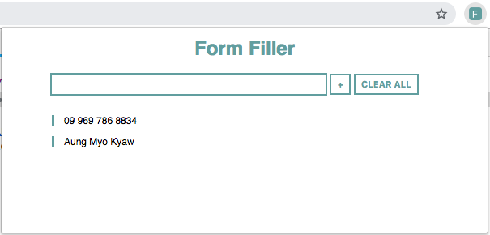
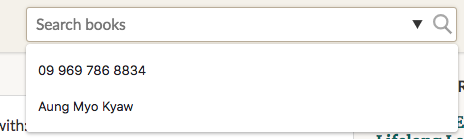

# form filler

> form filler google chrome extension


## User guide

- [ CLICK HERE TO INSTALL ][chrome-url]
- [ Setting up Form Data ](#)



- [ SCREENSHOT ](#)



## Development

### Install Required Package

```shell
npm install
```

### Build

```shell
npm run build
```

### Load Extension

- go `chrome://extensions/`
- load unpack extension
- choose dist dir

## Built with

- [typescript](https://www.typescriptlang.org/)

## LICENSE

[MIT](./LICENSE) @ [ Aung Myo Kyaw ](https://github.com/AungMyoKyaw)

[chrome-url]: #
